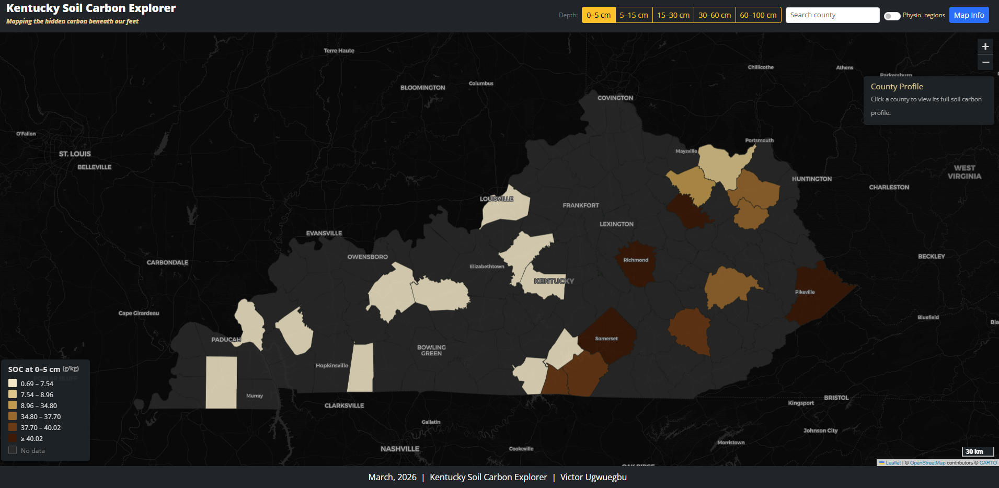

# Kentucky Soil Carbon Explorer

[](https://victorugwuegbu.github.io/kentucky-soil-carbon-explorer/)

**Course:** MAP673: Design for Interactive Mapping  
**Author:** Victor Ugwuegbu  
**Beta live map:** https://victorugwuegbu.github.io/kentucky-soil-carbon-explorer/  
**GitHub repository:** https://github.com/victorugwuegbu/kentucky-soil-carbon-explorer  

---
## Map Preview



---

## Project overview

Kentucky Soil Carbon Explorer is an interactive web map designed to visualize county level soil organic carbon across Kentucky at five depth intervals: 0–5 cm, 5–15 cm, 15–30 cm, 30–60 cm, and 60–100 cm. The project was developed as a beta map for MAP673: Design for Interactive Mapping. Its purpose is to communicate how soil carbon varies spatially across the state and vertically through the soil profile in a way that is visually intuitive and easy to explore.

The map is motivated by my research interests in soil health, soil sensing, and environmental analysis. Soil organic carbon is a fundamental indicator of soil condition because it is closely related to nutrient availability, aggregate stability, water retention, biological activity, and long term land management outcomes. In many soil datasets, however, the information is stored in tabular form and is difficult for non-specialists to interpret spatially. This project addresses that problem by turning the data into an interactive county-level thematic map.

---

## Project goals

The main goal of this project is to design a clear and usable interactive map that allows users to compare soil organic carbon across Kentucky counties and across depth intervals. I wanted the map to support simple exploratory questions such as:

- Where in Kentucky is soil organic carbon relatively high or low?
- How do those patterns change when the depth interval changes?
- Which counties show stronger or weaker soil carbon values through the profile?
- How do those patterns relate to broader Kentucky landscapes?

This project also gave me an opportunity to apply design decisions that are central to interactive mapping, including information hierarchy, interface clarity, thematic color choice, depth switching, and progressive disclosure through tooltips, popups, and a map info panel.

---

## Intended users

The map is designed for a mixed audience.

The first audience is soil scientists and environmental researchers who may want to compare counties or inspect broad regional patterns in carbon distribution.

The second audience is students and educators who need a visual tool for understanding how soil carbon changes across depth and space.

The third audience is agricultural and land management users who may benefit from a more accessible way to explore soil-related spatial information without needing to work directly in GIS software.

---

## Data sources

The county level soil values were derived from **USDA NRCS Soil Data Access**, which provides access to SSURGO tabular data. The soil table was queried from the public service, summarized by county-relevant units, and prepared outside the browser. 

Kentucky county boundaries came from **US Census TIGER/Line county boundary data**, which provided the polygon geometry used for the choropleth map. 

The physiographic region overlay was obtained from the **Kentucky open data portal** dataset for Kentucky physiographic regions. This layer was prepared separately and added as an optional contextual overlay. 

### Data source links
- USDA NRCS Soil Data Access: https://sdmdataaccess.nrcs.usda.gov/
- US Census TIGER county boundaries: https://www.census.gov/geographies/mapping-files/time-series/geo/tiger-line-file.html
- Kentucky Physiographic Regions: https://opendata-kygeonet.opendata.arcgis.com/datasets/ky-physiographic-regions-1

---

## Data preparation workflow

I followed a workflow that fits the logic of the course and keeps the browser map lightweight and stable.

First, I queried the public SSURGO Soil Data Access service to retrieve soil organic matter values by depth. The returned soil table was exported for further processing.

Second, I downloaded county boundaries for the United States and filtered the county layer to Kentucky in QGIS.

Third, I created a matching join field so the soil table and the county boundary layer could be connected correctly.

Fourth, I joined the cleaned soil table to the Kentucky county polygons in QGIS and created soil organic carbon fields for each depth interval.

Fifth, I refactored the fields to keep only the attributes needed for the web map and exported the final cleaned county layer as GeoJSON.

This workflow was chosen because it mirrors a professional GIS process: acquire data, clean and structure it in GIS software, then publish a streamlined dataset to the web map.

---

## Map design reasoning

The project uses a dark basemap so the thematic layer remains visually dominant and the county polygons are easy to distinguish. This also makes the interface feel more focused and reduces background distraction.

I chose a brown sequential color palette because it is closely associated with soils and organic matter, making the thematic message more intuitive. A green palette could work, but the brown ramp better reinforces the soil theme and visually aligns with the subject matter.

The county tooltip provides a quick preview of the current depth value. The county info panel provides a fuller profile across all five depths. This separation supports a layered user experience: a user can glance at values quickly or choose to inspect a county in more detail.

The map header contains the primary controls to keep the interaction model compact and visible. The depth selector is placed prominently because changing depth is the most important interaction in the map.

---

## Classification

The choropleth uses **Jenks natural breaks** to classify county values. This choice was made because soil carbon values are not evenly distributed and often contain clusters and gaps. Jenks natural breaks helps preserve those natural groupings better than equal interval classification.

The classification is recalculated when the selected depth changes so the legend and colors remain appropriate for the active depth interval.

---

## Current beta functionality

The current beta includes the following working features:

- county level soil organic carbon choropleth
- five depth buttons for changing the mapped depth interval
- dynamic legend updates
- county hover tooltips
- county click interaction
- county information panel with full depth profile
- search box for zooming to counties
- scale bar
- map info offcanvas panel
- optional physiographic region overlay

---

## Beta limitations and planned improvements

This beta version is functional, but one area I plan to improve in the final map is the relationship between county polygons and physiographic regions.

At this stage, the physiographic regions are included as a contextual overlay, but I still want to refine the way physiographic region information is linked directly to county-level summaries. In the final version, I plan to improve this by making the county-to-region association more explicit and robust, either through a cleaner spatial join workflow in QGIS or a more refined spatial lookup strategy.

Other improvements I would like to make in the final version include:

- refining the physiographic region integration
- improving county search behavior with stronger suggestions or autocomplete
- adding a stronger explanatory note about county-level aggregation
- improving the mobile layout further
- exploring whether a small summary graphic or interpretation panel should be added

---

## Update

Since the beta presentation, I improved the functionality of the physiographic regions in the map interface. In the earlier beta version, the physiographic overlay acted mainly as a visual reference layer and still needed stronger integration with county level interaction. In the updated version, I refined the user experience so that the physiographic regions work more smoothly alongside county selection and inspection. This makes the overlay more useful as contextual information rather than simply an additional graphic on top of the map.

I also continued polishing the layout and interaction design of the map by improving visual hierarchy, strengthening the relationship between the legend and the active depth selection, and making the county profile panel easier to interpret. These updates support the overall goal of the project, which is to make county level soil carbon patterns across Kentucky easier to explore and compare.

---

## Technology stack

The project uses HTML, CSS, and JavaScript for the web interface, Leaflet for interactive web mapping, Bootstrap for layout and interface structure, Chart.js for the county profile visualization, and simple-statistics for Jenks natural breaks classification. Spatial data preparation, cleaning, joins, and export were completed in QGIS before deployment to GitHub Pages.

---

## Conclusions and insights

The map shows that soil organic carbon is not evenly distributed across Kentucky and that spatial patterns shift as depth changes. This reinforces the importance of interactive depth comparison in communicating soil variation. It also shows the value of combining cleaned spatial data, clear thematic design, and lightweight web mapping tools into an interface that supports both exploration and interpretation.

At the design level, this project confirmed that interactive maps are most effective when the user’s point of entry is clear, the map controls are closely tied to the visual change they trigger, and contextual layers are introduced in ways that support rather than distract from the main thematic message. For this project, the depth selector, county information panel, search box, and physiographic overlay all work together to help users move from broad spatial overview to county specific inspection.

---

## How to use the map

Use the depth buttons in the header to switch between soil depth intervals. The county colors and legend update automatically when the active depth changes.

Hover over a county to see the current soil carbon value for the selected depth.

Click a county to open the county profile panel and inspect all five depth values at once.

Use the search box in the header to quickly zoom to a county by name.

Turn on the physiographic regions switch to compare the county data with Kentucky’s broader landscape framework.

Open the “Map Info” panel to read about the map, methods, sources, and classification choices.

---

## Repository structure

```text
kentucky-soil-carbon-explorer/
├── index.html
├── README.md
└── data/
    ├── ky_counties_soc.geojson
    └── ky-physio-regions.geojson
└── images/
    └── map-preview.png

    The project is published through GitHub Pages, and the live interactive map can be accessed at the GitHub Pages URL listed at the top of this README.